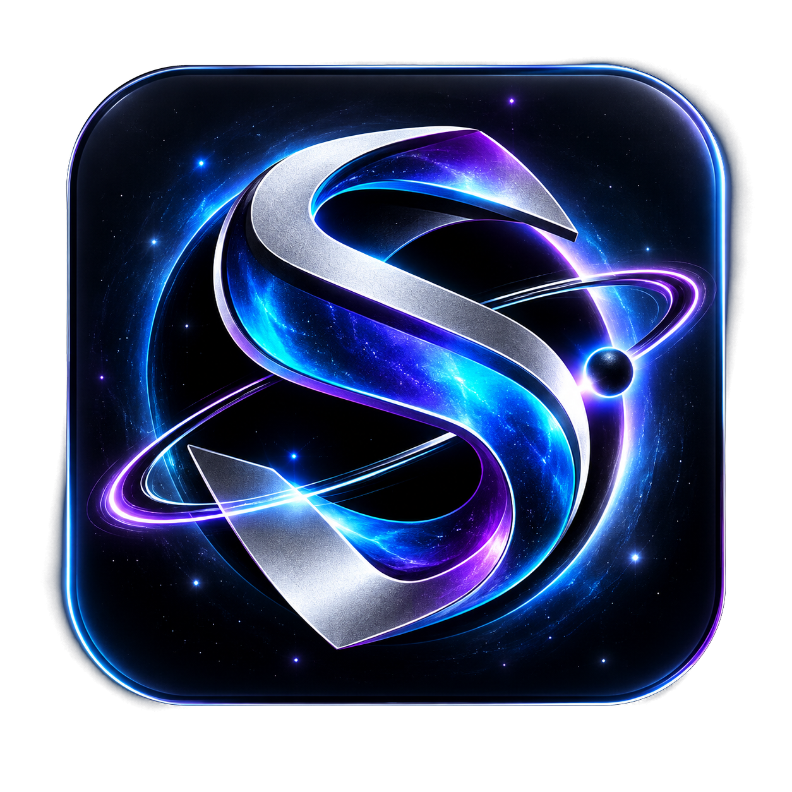

# Syntara



**Syntara: The Universal Local AI Runtime by NDe: NoirDemons.**

Syntara brings model discovery, import, compatibility analysis, hardware-aware execution, local Chat, Agent workflows, persistent memory, backups, developer APIs and cross-platform desktop UX into one zero-auth product.

## Download

The product website is designed to put downloads first:

- Windows
- macOS
- Linux
- additional builds as they are released

No Syntara account is required.

## Product architecture

```text
Syntara
  ↓
Chat · Agents · API
  ↓
Control Plane
  ├─ Model Hub
  ├─ Model Manager
  ├─ Download Manager
  ├─ Projects
  ├─ Local Memory
  └─ Backup / Restore
  ↓
Universal Model Layer
  ↓
Backend Router
  ↓
Syntara Engine + other compatible backends
  ↓
CPU · GPU · RAM · VRAM · SSD
```

## Core capabilities

- Major local model formats with architecture-aware compatibility checks
- Automatic model metadata and hardware planning
- GGUF, Safetensors and Hugging Face import paths
- Conversion and quantization extension points
- CPU-first and GPU-accelerated execution paths
- Memory/storage tiering and streaming
- MoE expert-aware execution and dense-model streaming paths
- KV-cache and context-budgeting architecture
- Chat Mode
- Agent Mode with permission gates
- Model Hub and integrated download manager
- Projects and persistent local memory
- Local backup / import / restore
- OpenAI-compatible local API
- Python SDK
- Developer CLI
- n8n / VS Code / IDE integration surface
- Windows, macOS and Linux desktop shell
- Light / Dark / System UI modes
- Open-source development model

## No account philosophy

Syntara does not require a Syntara login, signup, activation account or cloud identity. Persistent data is designed to remain on the user's device unless the user explicitly exports or connects another service.

## Development

The repository contains the native execution core, desktop application, web UI, model management layer, Python SDK, CLI and integration material.

The deep inference engine remains a low-level systems component. Universal model compatibility is implemented at the platform layer through format detection, architecture adapters and backend routing rather than by forcing every model into one proprietary format.

## Legal and attribution

Syntara contains modified third-party code released under its original licenses. The root `LICENSE`, `NOTICE` and `THIRD_PARTY_NOTICES.md` files are preserved for the required legal attributions. See `MODIFICATIONS.md` for the Syntara changes in this distribution.
